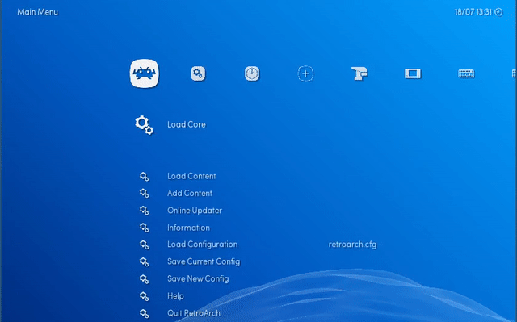

Configuring audio has become tricky on devices with more than one audio card. Some boards such has Cubieboard2, Banana Pi, Cuboxi, or Hummingboard have two or three audio cards. For example, on Cubieboard2, the first card hw:0,0 will output through jack, while the second card hw:0,1 will output through HDMI.

Generic PCs can have even more.

Lakka can use only one of these cards at a time. So if you get no sound, it means you need to switch to another card.

## Switching audio device from the GUI

In recent versions of Lakka, you can go to the **Audio Settings** and switch the **Audio Device** using the left and right keys. You need to restart RetroArch for this change to take effect.

## Switching audio device manually

### Listing your audio cards

To list those cards, you have use the [command line interface](Accessing-Lakka-command-line-interface) and type one of these commands:

    aplay -L

You will get this kind of output:

    null
        Discard all samples (playback) or generate zero samples (capture)
    pulse
        PulseAudio Sound Server
    default
        Default ALSA Output (currently PulseAudio Sound Server)
    sysdefault:CARD=PCH
        HDA Intel PCH, CS4206 Analog
        Default Audio Device
    front:CARD=PCH,DEV=0
        HDA Intel PCH, CS4206 Analog
        Front speakers
    surround21:CARD=PCH,DEV=0
        HDA Intel PCH, CS4206 Analog
        2.1 Surround output to Front and Subwoofer speakers
    surround40:CARD=PCH,DEV=0
        HDA Intel PCH, CS4206 Analog
        4.0 Surround output to Front and Rear speakers
    surround41:CARD=PCH,DEV=0
        HDA Intel PCH, CS4206 Analog
        4.1 Surround output to Front, Rear and Subwoofer speakers
    surround50:CARD=PCH,DEV=0
        HDA Intel PCH, CS4206 Analog
        5.0 Surround output to Front, Center and Rear speakers
    surround51:CARD=PCH,DEV=0
        HDA Intel PCH, CS4206 Analog
        5.1 Surround output to Front, Center, Rear and Subwoofer speakers
    surround71:CARD=PCH,DEV=0
        HDA Intel PCH, CS4206 Analog
        7.1 Surround output to Front, Center, Side, Rear and Woofer speakers
    hdmi:CARD=PCH,DEV=0
        HDA Intel PCH, HDMI 0
        HDMI Audio Output
    hdmi:CARD=PCH,DEV=1
        HDA Intel PCH, HDMI 1
        HDMI Audio Output
    hdmi:CARD=PCH,DEV=2
        HDA Intel PCH, HDMI 2
        HDMI Audio Output

### Setting audio_device

The config key for the audio device is **audio_device**. For example:

    audio_device = "hdmi:CARD=PCH,DEV=0"

But please bear in mind that you need to [stop retroarch](http://www.lakka.tv/doc/Configuring-Lakka/#using-the-command-line-interface) before editing the configuration file.

## Audio Output Rate

The default rate, 48KHz, should be OK in most case. If you hear audio crackling or if games are slow like 55fps, you may need to use 44.1KHz instead.
