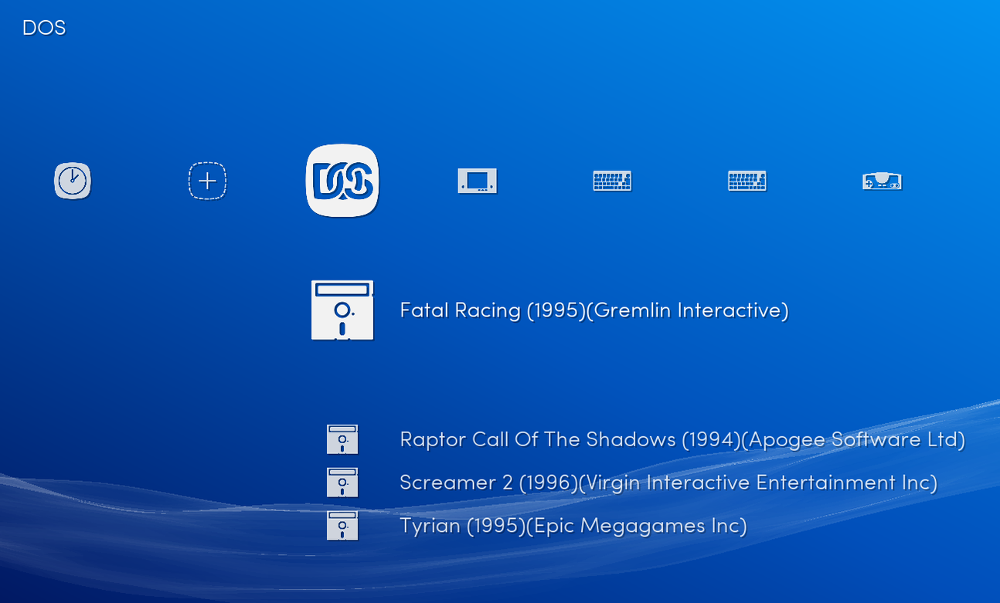
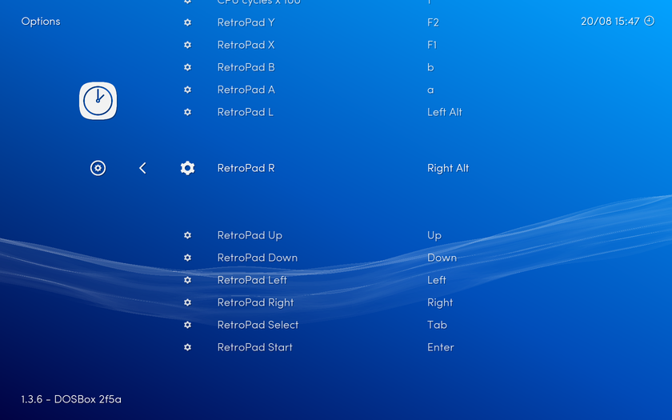

## Playlist support

DOSBox can use per game [configuration file](https://www.dosbox.com/wiki/Dosbox.conf#Sections) to launch game. Please check the [compatibility list](https://www.dosbox.com/comp_list.php?letter=a) to get specific configuration, here is a minimal configuration file to launch game automatically

    [autoexec]
    @echo off
    mount d "/storage/roms/dos/game"
    d:
    game.exe

After, you can create your [playlist](Playlists) like

    /storage/roms/dos/game/game.conf
    MS-Dos Game Name
    /tmp/cores/dosbox_libretro.so
    DOS (DOSBOX) 
    DETECT
    DOS.lpl

It should be named `DOS.lpl` and located in `/storage/playlists`

## Controller support

Emulated mouse support is default to Right Stick, L2, R2.

Use the Core Options to map key to RetroPad.

