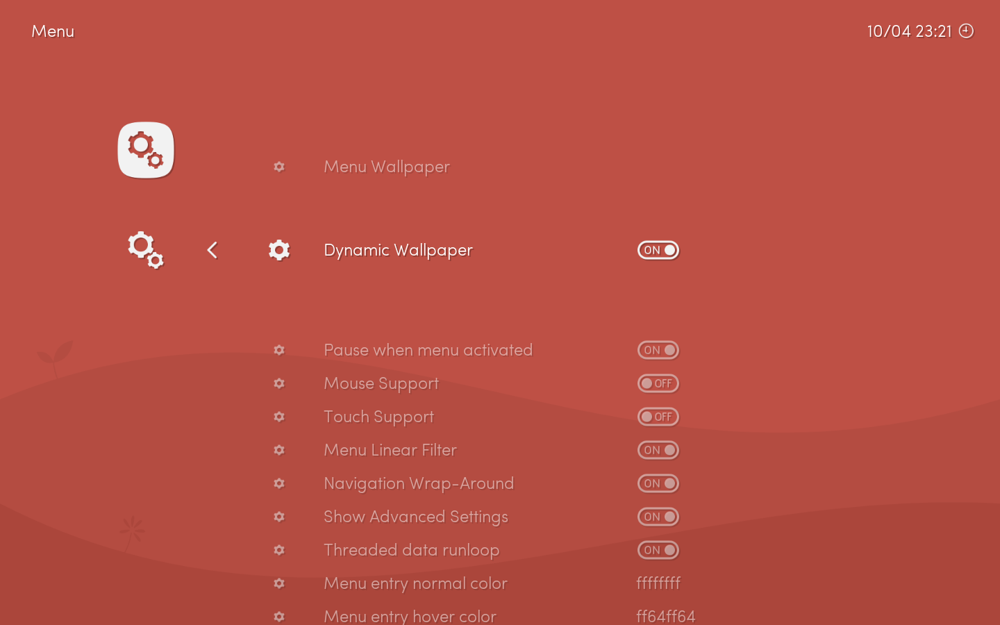
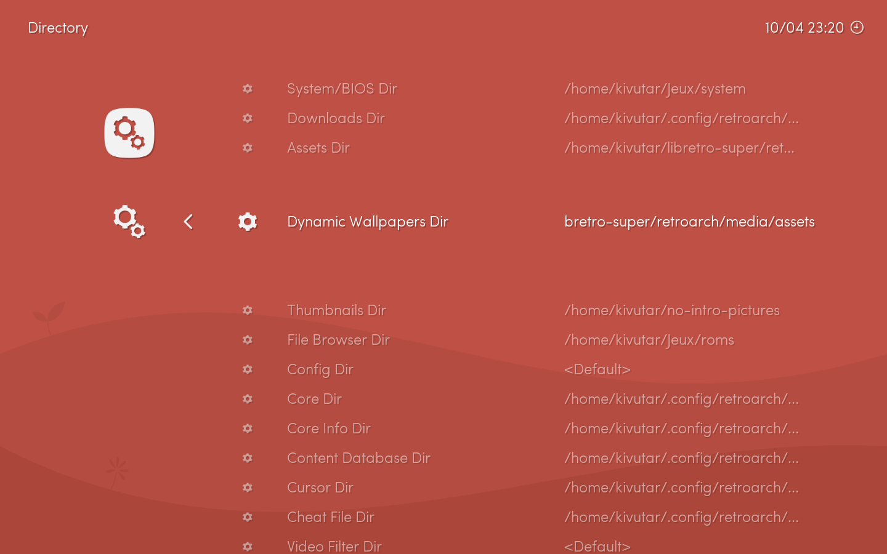

Lakka can be configured to load a new wallpaper for each system icon on the horizontal list. This feature is referred to as Dynamic Wallpapers, or sometimes Per-System Wallpapers.

`Dynamic Wallpaper` must be enabled in the `Menu` settings. **Please note that the 'Ribbon' must be disabled in order for the wallpaper to appear.**

Then, you must go to the `Directory` settings and set your `Dynamic Wallpapers Dir` to point to a directory containing wallpaper images. The images have to be PNG, and named to match the screen title which appears in the top-left corner of the screen when you navigate the horizontal menu.

Currently, three wallpaper themes are provided in the default installation of Lakka. They are located in the directory `/tmp/assets/wallpapers`. Each wallpaper theme has a subfolder labelled by its image resolution.

## Setting the wallpaper directory:

1. From within Lakka's wallpaper directory configuration menu, navigate to the `tmp` folder, then navigate to `assets`, followed by `wallpapers`.
1. Select the theme you would like to use, for example `bichromatic pads`, by entering the corresponding folder.
1. Enter the subfolder labelled for its image resolution, for example `1440x900`.
1. Select `<Use this directory>`
1. Save your current RetroArch configuration
1. Quit RetroArch to initiate RetroArch reloading the configuration file
1. Systems with corresponding wallpaper images in the selected wallpaper theme will now have their wallpapers display when that system is focused in the horizontal menu