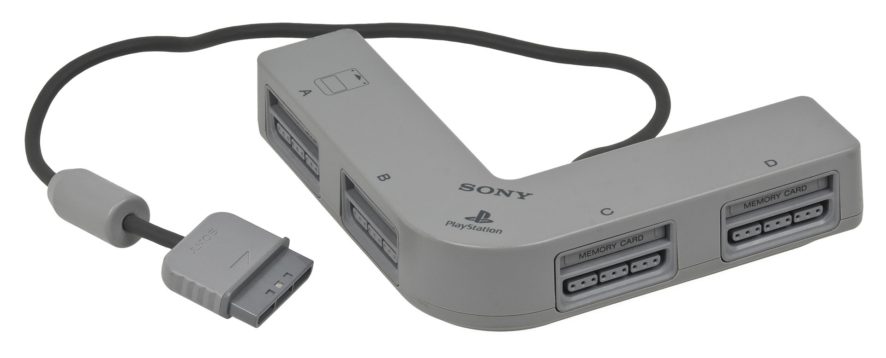
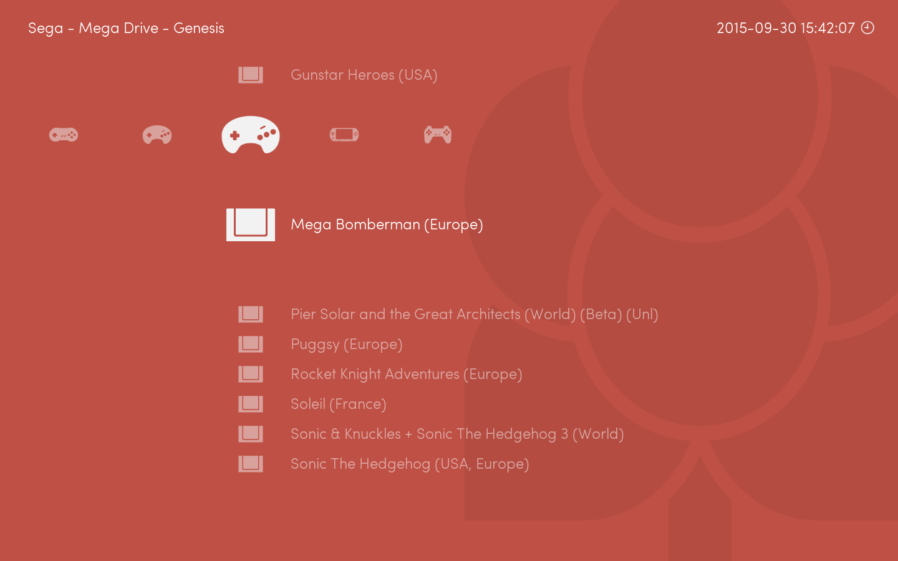
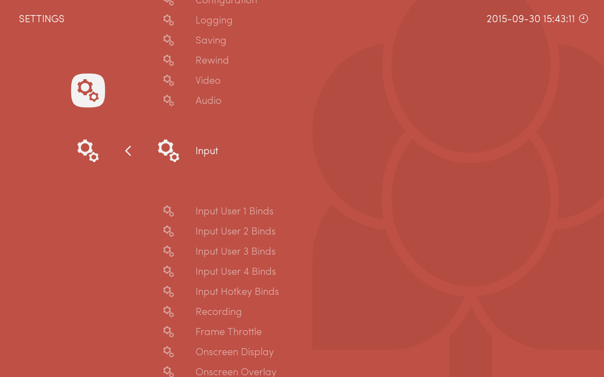
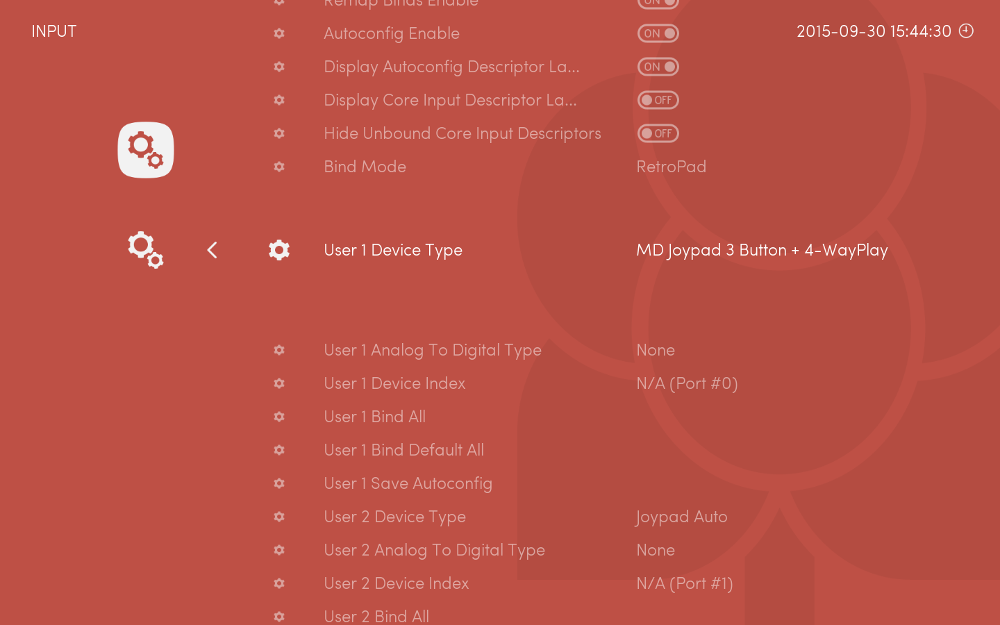

Multitaps were devices allowing to plug more than two joypads on consoles like the SNES or the Sega Genesis. RetroArch allows you to play up to five people on some games, by emulating these multitap devices.

The following guide explains how to configure inputs to use that multitap.

First, launch a game that supports more than 2 players.

Then, go to Settings, and select Input Settings.

Set the player 1 mode to Multitap (can be named differently depending on the current core)

Go back to the game, you should now be able to play with more than 2 friends.

Note: A bug affects multitap support for certain games in the snes9x-next and pocketsnes cores.
