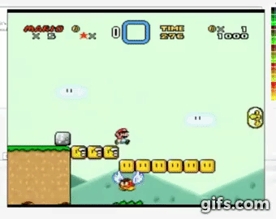
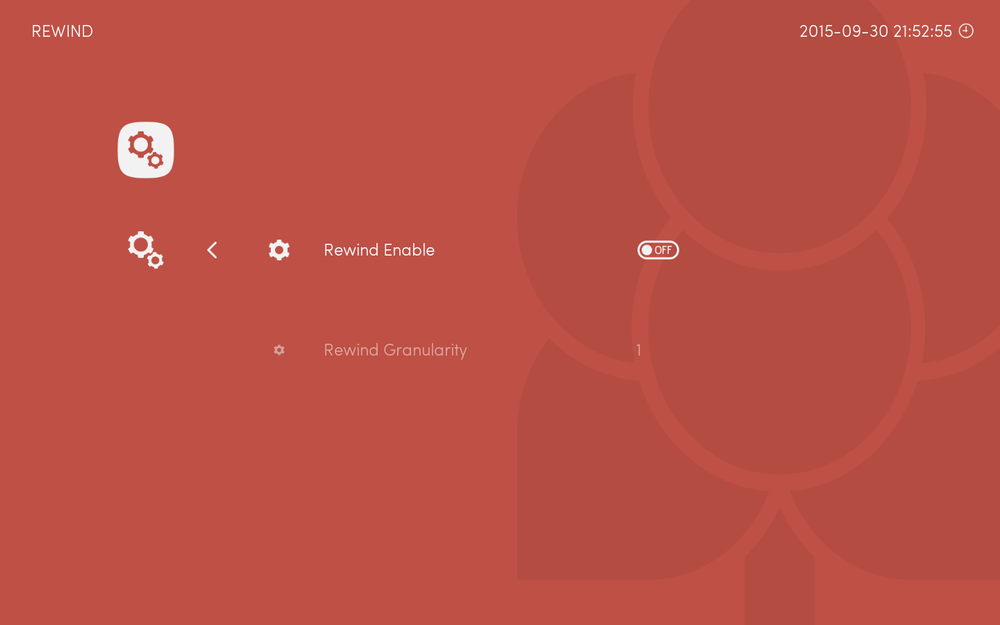
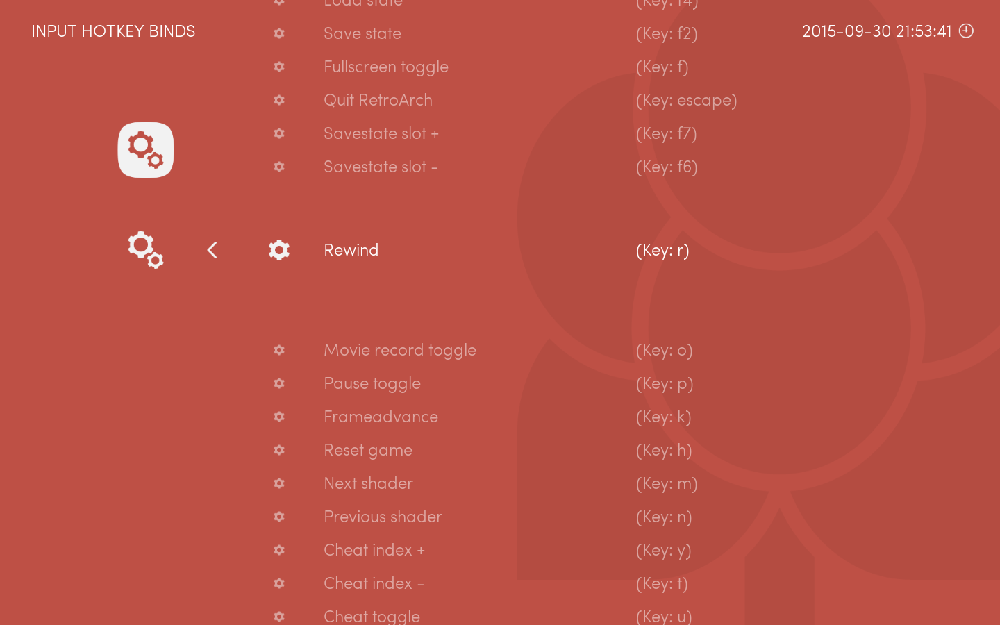

Warning: this page refers to features or interfaces present on the development version of Lakka.

RetroArch will allow you to rewind your game in real time.

This video demonstrate the rewind feature:

Rewinding depends on savestates, so it will not work on libretro cores that doesn't support savestates, as NXEngine.

To enable rewinding, go to Settings->Rewind, and set it to ON.

Note that rewinding will affect performance. That's why it is disabled by default in Lakka. If you really want to use it, you can change the granularity.

If you don't use a keyboard and prefer controlling everything with a joypad, you will have to bind the rewind hotkey to a button of your pad:

