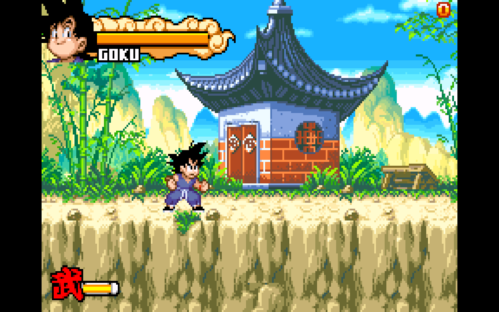
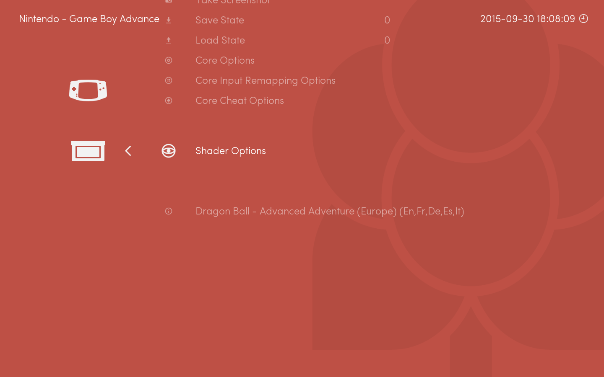
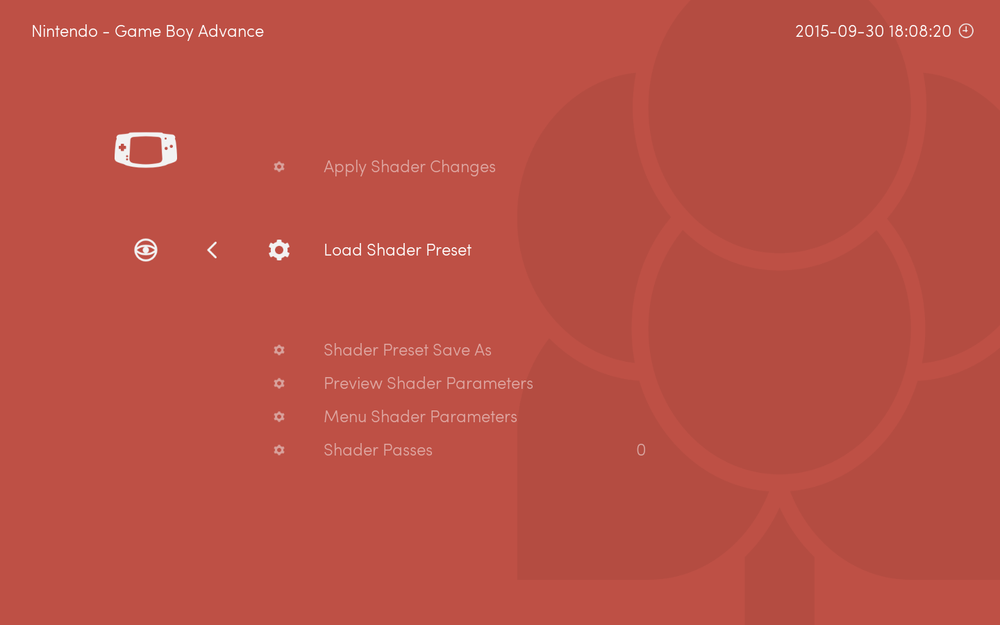
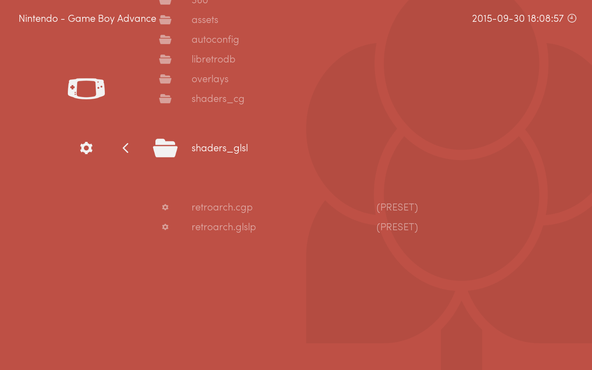
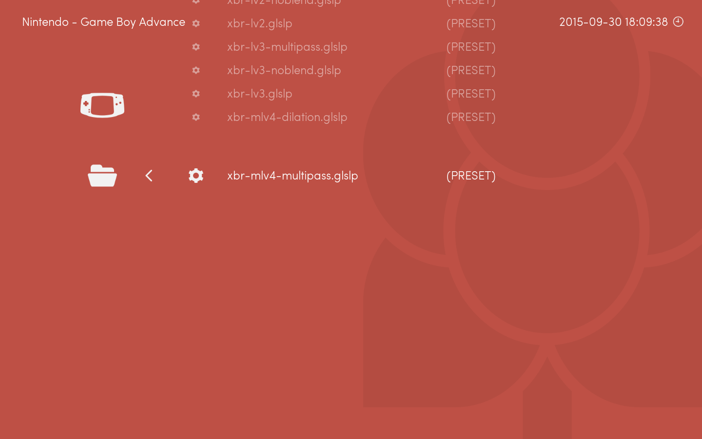
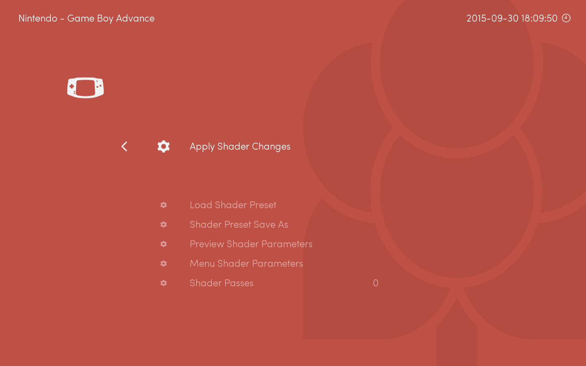
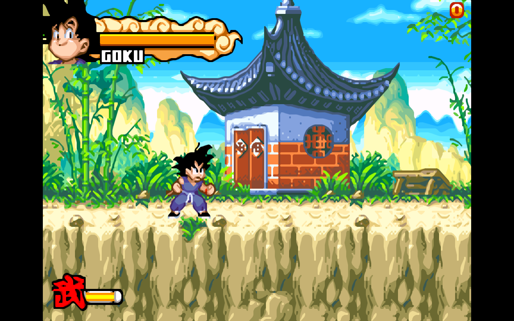

Warning: this page refers to features or interfaces present on the development version of Lakka.

In RetroArch, shaders are hardware accelerated video filters. They can enhance the rendering of the game, or make it looks closer to the original hardware supposed to run it.

## Using a shader preset.

First, launch a game:

Then, go back to the menu, and go to the *Shader Options* entry:

Go to *Load Shader Preset*. RetroArch allow stacking many shaders manually, but for now we will go with a preset.

Lakka supports only the GLSL format, so go to *glsl_shaders*.

For this example, I choose xbr/xbr-mlv4-multipass.glslp

This shaders is very heavy, so don't use it on weak hardware like the Raspberry Pi. There are lighter ones.

If the shader preset loaded properly, you should see a few lines describing the different passes defined in the preset.

Apply changes.

And go back to the game. You should notice a visual effect applied on the image.

