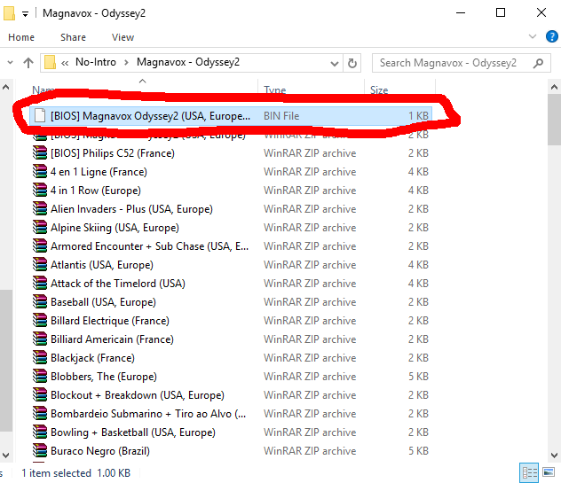
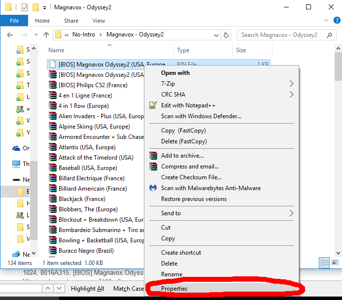
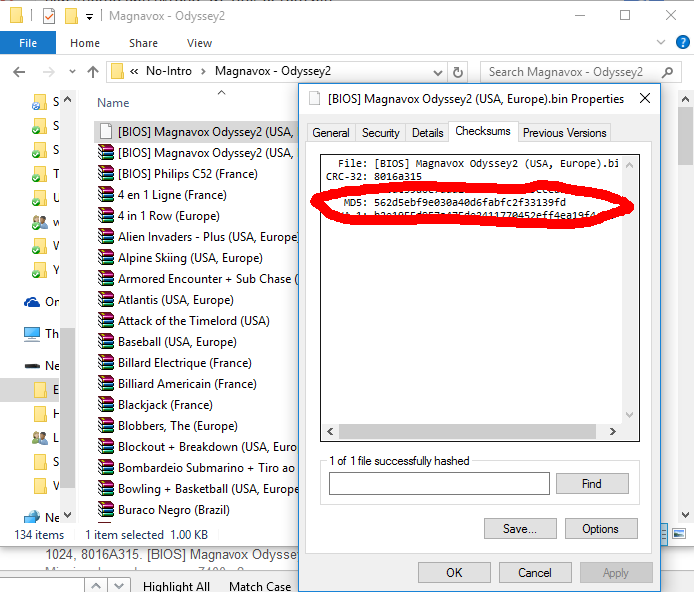
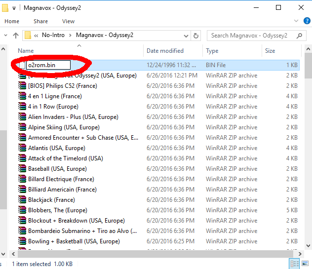
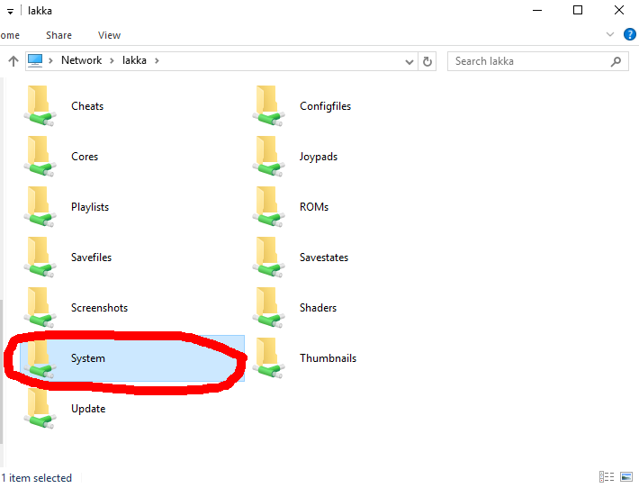

In order to ensure that you are using the correct BIOS file for a given system, we recommend verifying the MD5 checksum of a BIOS image against [the official MD5 checksums listed in the BIOS table](BIOSes#bios-requirements-table).

### Windows 10
The open-source **HashCheck Shell Extension** featured in these screenshots makes checking an MD5 checksum in Windows 10 fairly straightforward.

| Action | Screenshot |
|:---|:---|
| 1. Select the BIOS file you would like to verify in Windows Explorer. This example uses a file which claims to be a Magnavox Oddessy2 BIOS. |  |
| 2. Right-click and then select `Properties`. Generally, this option appears at the bottom of the right-click context menu. |  |
| 3. Select the `Checksums` tab and locate the MD5 checksum. In this case the checksum of `562d5ebf9e030a40d6fabfc2f33139fd` is a match. |  |
| 4. Rename the BIOS file to match the table below, being sure to match the case. Sometimes Windows makes it difficult to see or change the file extension -- be sure that the extension is also correct. | |
| 5. Transfer the BIOS image into the Lakka `system` folder so it can be used to load the corresponding libretro emulator core. |  |

### Windows 7
[MD5sums](http://www.pc-tools.net/win32/md5sums/) is a lightweight and portable tool that works hassle-free using the drag-&-drop method. Simply drag each file over md5sums.exe and the resulting sum will be displayed. BIOS files, usually light on size, will be displayed immediately, however, ROMs, typically large files, will produce a percentage bar indicating when to expect the output.

Alternatively, [md5summer](http://md5summer.org), is another option.

### Linux
md5sum should be available by default. If otherwise, install coreutils package.

1. Open a Terminal.
2. Go to directory where files are placed by typing: `cd /path/to/directory/`.
3. Type `md5sum XXXX` where XXXX is the name of your BIOS.

### Mac
1. Open a Terminal
2. Type `md5`
3. Drag and drop your file to the terminal then press `Enter`.

### Online
Sums can be checked [online](https://lmddgtfy.net/?q=md5%20online), too.

## DAT Verification

You can verify all BIOS files automatically, with [System.dat](https://github.com/libretro/libretro-database/blob/master/dat/System.dat), through one of the following programs:

- [clrmamepro](https://mamedev.emulab.it/clrmamepro/)
- [ROMCenter](http://www.romcenter.com)
- [ROMulus](http://romulus.net63.net/)
- [RomVault](http://www.romvault.com/)
